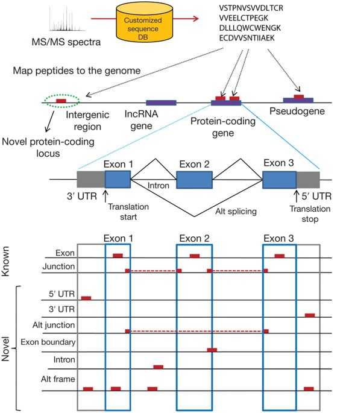

# Introduction

Proteogenomics is a field of biological research that utilizes a combination of proteomics, genomics, and transcriptomics to aid in the discovery and identification/quantification of peptides and proteins. Proteogenomics is used to identify new peptides by comparing MS/MS spectra against a protein database that has been derived from genomic and transcriptomics information.

{ width="450" }

In this approach, customized protein sequence databases generated using genomic and transcriptomic information are used to help identify novel peptides (not present in reference protein sequence databases) from mass spectrometry-based proteomic data; in turn, the proteomic data can be used to provide protein-level evidence of gene expression and to help refine gene models.

Proteogenomics can be also seen as the way to present proteomics evidences in a genomics context.

!!! note
    You can read more about the topic here: [https://www.nature.com/articles/nmeth.3144](https://www.nature.com/articles/nmeth.3144)
