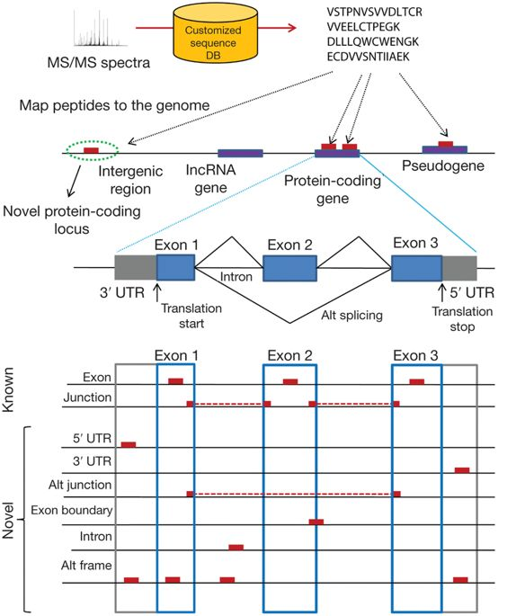

Introduction
============

.. sidebar:: Individual Tools Documentation
   :subtitle: **It can make your life easier** if you want to explore individual tools:

   - :doc:`pepgenome`
   - :doc:`pepbed`:

Proteogenomics is a field of biological research that utilizes a combination of proteomics, genomics, and transcriptomics to aid in the discovery and identification/quantification of peptides and proteins. Proteogenomics is used to identify new peptides by comparing MS/MS spectra against a protein database that has been derived from genomic and transcriptomics information.

In this approach, customized protein sequence databases generated using genomic and transcriptomic information are used to help identify novel peptides (not present in reference protein sequence databases) from mass spectrometry–based proteomic data; in turn, the proteomic data can be used to provide protein-level evidence of gene expression and to help refine gene models. In recent years, owing to the emergence of new sequencing technologies such as RNA-seq and dramatic improvements in the depth and throughput of mass spectrometry–based proteomics, the pace of proteogenomic research has greatly accelerated. Here I review the current state of proteogenomic methods and applications, including computational strategies for building and using customized protein sequence databases. I also draw attention to the challenge of false positive identifications in proteogenomics and provide guidelines for analyzing the data and reporting the results of proteogenomic studies.

.. note:: You can read a more about the topic here: https://www.nature.com/articles/nmeth.3144

