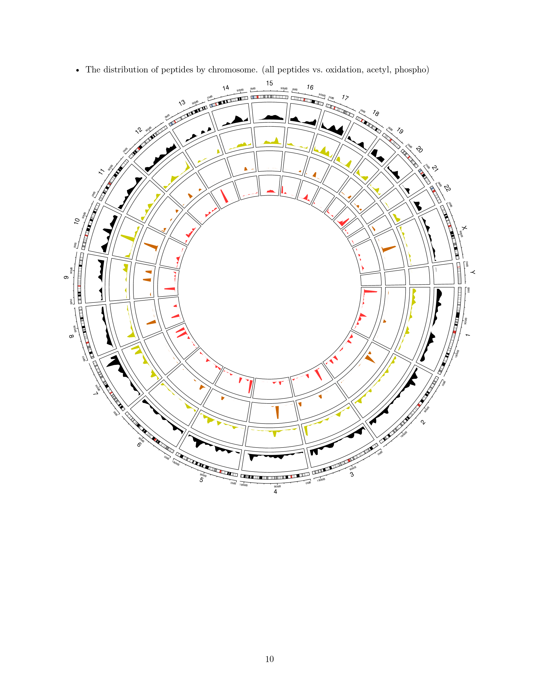

.. _pepbedr

PepBedR: R package to analyze peptidoforms features in Bed Files
==========================================

The PepBedR package allows users of :ref:`bed` file format to analyze and visualized their data and results. It facilitate two major things:

- Descriptive statistics of PepBed files: Number of unique peptides per chromosome, transcript, gene.
- Circle plots of peptide features by different Peptide properties (Modification, Uniqueness, Sample properties).

.. note:: The PepBedR provides set ```Rscript``` utilities to describe PepBed files.


Using R package
------------------

Parsing Bed file
~~~~~~~~~~~~~~~~~

.. code-block:: R
   :linenos:

   bed_path <- '/home/biolinux/temp/human/pride_cluster_peptides_9606_Human_pogo.bed'

   granges_peptide <- importBEDasGRange(inputFile = bed_path)

   n_features <- length(granges_peptide)
   message(c('Imported ', n_features, ' peptides...'))

Computing some basic stats from the data
~~~~~~~~~~~~~~~~~~~~~

The PepBedR provides a set of functions and rutines to compute descriptive statistics for each input file.

.. code-block:: R
   :linenos:

   counts <- countsByChromosome(gr = granges_peptide, colName = 'Peptides')

   merged_counts <- orderByChromosome(df = count, colName = 'Chromosome')

   print(merged_counts)

This code will print the number of peptides per chromosome.


Getting stats for unique peptides
~~~~~~~~~~~~~~~~~~

.. code-block:: R
   :linenos:

   # Removing duplicated entries from original granges_peptide.

   unique_pep <- getUniqueFeatures(granges_peptide, colFeatures = 'name')

   getting unique number of features(peptides) by chromosome
   counts_unique <- countsByChromosome(gr = unique_pep, colName = 'Peptides')

   # ordering by chromosome
   merged_counts_unique <- orderByChromosome(df = counts_unique, colName = 'Chromosome')
   print(merged_counts_unique)


Visualizing the data
----------------------

The distribution of peptides by chromosome. (blue_track: modified peptide;  red_track: non-modified)

.. code-block:: R
   :linenos:

   library(circlize)
   circos.initializeWithIdeogram(species = 'hg19')
   bed <- bed_df
   bed_mod <- bed_mod_df
   circos.genomicDensity(bed, col = c("#FF000080"), track.height = 0.1, baseline = 0)
   circos.genomicDensity(bed_mod, col = c("#0000FF80"), track.height = 0.1, baseline = 0)
   circos.clear()

Output:

.. centered::



.. note:: The distribution of peptides by chromosome. The PepBedR package use the same color code that :ref:`bed` to each track.

Reports
------------------

The current package provides a way to generate **pdf** reports by running the following RScript::

     Rscript --verbose --vanilla scripts/build_pepbed_report.R -i PepGenome-Peptide-Atlas.bed.gz
         -ref 'hg38' -o report_peptide_atlas.pdf


The build_pepbed_report.R compute compute a full report for a bed file. The paramters ```-ref``` is the Genome Assembly version used to perform the mapping to genome coordinates; and the ```-i``` and ```-o``` are the input bed and output pdf folder.


