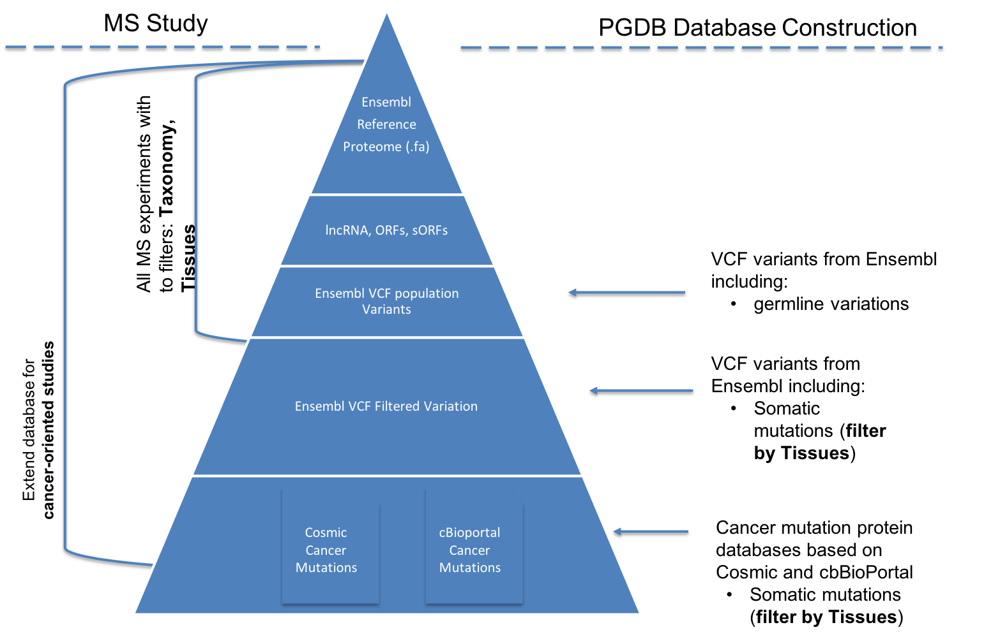

.. _workflows

PGATK Nextflow Workflows
===============

The ProteoGenomics Analysis Toolkit provides a set of workflows to perform large scale proteogenomics data analysis. All workflows are developed using `nextflow <https://www.nextflow.io/>`_ and `BioContainers <http://biocontainers.pro>`_.

In order to execute any of the PGATK workflows the user should

Requirements
---------------

Starting with Nextflow
~~~~~~~~~~~~~~~~~~~~~~~

Nextflow can be used on any POSIX compatible system (Linux, OS X, etc). It requires **Bash 3.2** (or later) and **Java 8** (or later, up to 11) to be installed.

Installation, it only needs two easy steps:

Download the executable package by copying and pasting the following command in your terminal window:

.. code-block:: bash
   :linenos:

   wget -qO- https://get.nextflow.io | bash

.. node:: It will create the nextflow main executable file in the current directory. Optionally, move the nextflow file to a directory accessible by your $PATH variable (this is only required to avoid remembering and typing the full path to nextflow each time you need to run it).

Starting with Docker
~~~~~~~~~~~~~~~~~~~

All workflows required Docker or singularity. You can check `here <https://docs.docker.com/install/>`_ How to install docker into your workstation, or `here <https://sylabs.io/guides/3.3/user-guide/quick_start.html#quick-installation-steps>`_ if you are using Singularity.

Download the workflow
----------------------

All PGATK workflows are deposited in github. In order get the workflow in your machine, you can clone the repository using git command:

.. code-block:: bash
   :linenos:

   git clone https://github.com/bigbio/pgdb.git

Users can also run the workflows directly from github repositories using the following command:

.. code-block:: bash
   :linenos:

   nextflow run http://github.com/bigbio/pgdb

Running the workflow
---------------------

The following COMMAND will print the help of the workflow explaining all the pipeline/workflow options.

.. code-block:: bash
   :linenos:

   nextflow run main.nf --help

ProteoGenomics Database Workflow (pgdb)
----------------------------------------

The ProteoGenomics Database Workflow (pgdb) is a nextflow workflow that enables the generation of custom proteogenomics databases for MS proteomics studies.

